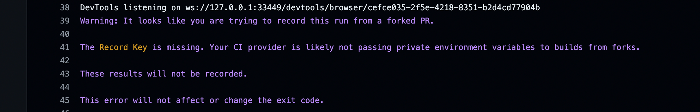

<!-- <p align="center"> -->
<!--   <a href="https://github.com/mr-scrpt/medium-nest-prisma" target="blank"> -->
<!--       -->
<!--   </a> -->
<!-- </p> -->

Medium Nest Prisma - Cypress Integration - Cortes 23 QA Challenge.
Welcome to the Medium Nest Prisma repository! This project showcases a comprehensive NestJS application adhering to real-world standards, incorporating modern architectural patterns such as GRASP and SOLID. With the recent integration of Cypress for end-to-end testing and GitHub Actions for continuous integration, this project ensures high-quality code and seamless development workflows.

🚀 Features
CRUD Operations: Complete implementation of Create, Read, Update, Delete operations.
Authentication: Secure authentication mechanisms.
Advanced Patterns: Leveraging GRASP and SOLID principles for maintainable and scalable code.
PostgreSQL: Integrated with PostgreSQL using Prisma ORM.
Docker: Database runs in a Docker container for easy setup.
Cypress: End-to-end testing with Cypress to ensure application reliability.
GitHub Actions: Automated CI/CD pipeline with GitHub Actions.

🛠️ Installation
Clone the repository:

```

git clone https://github.com/karlamieses/medium-nest-prisma-cortes-23.git
cd medium-nest-prisma-cortes-23
Install dependencies:

```

yarn install
Start PostgreSQL in Docker:

```

docker-compose up -d
Run database migrations:

```

yarn migrate:dev
(Optional) Add seed data:

```

yarn seed:dev
Start the application:

```

yarn start:dev
🧪 Cypress Tests
Cypress has been integrated into this project to provide robust end-to-end testing. This ensures that all features work as expected and helps catch bugs early in the development cycle.

Running Cypress Tests Locally
Start the application if it's not already running:

```

yarn start:dev
Run Cypress tests:

```

yarn cypress:open
This command opens the Cypress Test Runner, where you can run tests interactively.

Running Cypress Tests in CI/CD
Cypress tests are automatically run on pull requests and merges to the main branch using GitHub Actions.

GitHub Actions Workflow
The GitHub Actions workflow is defined in .github/workflows/cypress.yml:

‼️ Cypress Cloud Recording
Sadly, this repo was forked and for security purposes, GitHub does not allow reading the secrets either variable from forked repos, which means CYPRESS RECORD KEY is not being read. 




📚 Documentation
For more detailed documentation, please refer to:

NestJS: NestJS Documentation
Prisma: Prisma Documentation
Cypress: Cypress Documentation
GitHub Actions: GitHub Actions Documentation

🎉 Contributing
We welcome contributions! Please see the CONTRIBUTING.md file for guidelines on how to contribute.

📄 License
This project is licensed under the MIT License. See the LICENSE file for details.

Thank you for your interest in the Medium Nest Prisma project! We hope this README provides a clear and comprehensive overview of the project's features, installation steps, and testing setup.

Happy coding! 🚀
